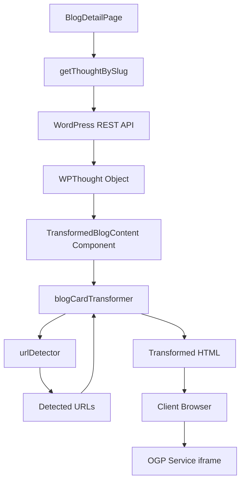

# 設計書

## 概要

本機能は、WordPress記事本文内の独立したURLを自動的にOGPブログカードに変換するシステムです。Next.jsサーバーコンポーネントで動作し、WordPress REST APIから取得したHTML本文を解析して、特定のパターンに一致するURLをiframeベースのブログカードに置換します。

主な特徴：
- サーバーサイドでの完全な処理（クライアント側の負荷なし）
- 軽量な文字列処理のみ（外部APIへのfetchなし）
- iframeによる遅延読み込み（loading="lazy"）
- Next.js ISRとの統合（24時間キャッシュ）
- 既存のBlogDetailPageコンポーネントへの最小限の変更

## アーキテクチャ

### システム構成図



### データフロー

1. **記事取得**: BlogDetailPageがWordPress APIから記事データ（WPThought）を取得
2. **URL検出**: urlDetectorが記事本文HTML内の独立したURLを検出
3. **URL変換**: blogCardTransformerが検出されたURLをiframeタグに変換
4. **レンダリング**: TransformedBlogContentコンポーネントが変換後のHTMLをクライアントに返す
5. **遅延読み込み**: ブラウザがiframeを遅延読み込みし、OGP Serviceからブログカードを取得

### レイヤー構造

```
Presentation Layer (React Server Component)
  └─ TransformedBlogContent.tsx
       │
Business Logic Layer (Pure Functions)
  ├─ blogCardTransformer.ts
  └─ urlDetector.ts
       │
Data Layer (WordPress API)
  └─ thoughts.ts (既存)
```

## コンポーネントとインターフェース

### 1. urlDetector モジュール

**責務**: 記事本文HTML内の独立したURLを検出する

**インターフェース**:

```typescript
/**
 * HTML文字列から独立したURLを検出する
 * @param html - 検索対象のHTML文字列
 * @returns 検出されたURLの配列
 */
export function detectIndependentUrls(html: string): string[]
```

**検出ロジック**:

1. 正規表現で`<p>`タグ内のURLを検出
2. 除外条件をチェック：
   - リンクタグ内のURL（`<a href="...">`）
   - 画像URL（.jpg, .png, .gif, .webp, .svg）
   - 自サイトURL（hidetaka.dev）
3. 重複を除去して返す

**正規表現パターン**:

```typescript
// <p>タグ内のURLを検出
const urlPattern = /<p[^>]*>(https?:\/\/[^\s<]+)<\/p>/gi

// 除外パターン
const linkPattern = /<a[^>]*href=["']([^"']+)["'][^>]*>/gi
const imageExtensions = /\.(jpg|jpeg|png|gif|webp|svg)$/i
const ownSitePattern = /hidetaka\.dev/i
```

### 2. blogCardTransformer モジュール

**責務**: 検出されたURLをiframeタグに変換する

**インターフェース**:

```typescript
/**
 * HTML文字列内のURLをブログカードiframeに変換する
 * @param html - 変換対象のHTML文字列
 * @param urls - 変換するURLの配列
 * @returns 変換後のHTML文字列
 */
export function transformUrlsToBlogCards(html: string, urls: string[]): string
```

**変換ロジック**:

1. 各URLに対して：
   - URLをエスケープ（encodeURIComponent）
   - OGP Serviceのエンドポイントを構築
   - iframeタグを生成
   - 元のURL文字列を置換
2. 変換後のHTMLを返す

**iframeタグテンプレート**:

```html
<iframe
  src="https://ogp-metadata-service-production.wp-kyoto.workers.dev/card?url={encodedUrl}"
  width="100%"
  height="155"
  frameborder="0"
  loading="lazy"
  style="border: 1px solid #e5e7eb; border-radius: 0.5rem; margin: 1rem 0;"
></iframe>
```

### 3. TransformedBlogContent コンポーネント

**責務**: 変換後のHTML本文をレンダリングするサーバーコンポーネント

**インターフェース**:

```typescript
interface TransformedBlogContentProps {
  thought: WPThought
  className?: string
}

export default function TransformedBlogContent({
  thought,
  className
}: TransformedBlogContentProps): JSX.Element
```

**処理フロー**:

1. 記事本文HTML（thought.content.rendered）を取得
2. urlDetectorで独立したURLを検出
3. blogCardTransformerでURLをiframeタグに変換
4. 変換後のHTMLをdangerouslySetInnerHTMLでレンダリング

**エラーハンドリング**:

- try-catchで変換処理を囲む
- エラー発生時は元のHTMLをレンダリング
- エラーをログに記録

### 4. BlogDetailPage コンポーネント（既存の修正）

**変更内容**:

```typescript
// Before
<div
  className="blog-content text-zinc-700 dark:text-zinc-300 leading-relaxed"
  dangerouslySetInnerHTML={{ __html: thought.content.rendered }}
/>

// After
<TransformedBlogContent
  thought={thought}
  className="blog-content text-zinc-700 dark:text-zinc-300 leading-relaxed"
/>
```

## データモデル

### WPThought 型（既存）

```typescript
interface WPThought {
  id: number
  title: {
    rendered: string
  }
  content: {
    rendered: string  // HTML本文（変換対象）
  }
  excerpt: {
    rendered: string
  }
  date: string
  slug: string
  link: string
  categories: number[]
  _embedded?: {
    'wp:term'?: Array<Array<{
      id: number
      name: string
      slug: string
      taxonomy: string
    }>>
  }
}
```

### URL検出結果

```typescript
type DetectedUrl = string  // 検出されたURL文字列
```

### 変換結果

```typescript
type TransformedHtml = string  // 変換後のHTML文字列
```

## 正確性プロパティ

プロパティとは、システムのすべての有効な実行において真であるべき特性や動作のことです。プロパティは、人間が読める仕様と機械で検証可能な正確性保証の橋渡しをします。


### プロパティ 1: 独立したURLの検出

*任意の*HTML文字列において、`<p>`タグ内に含まれるHTTP/HTTPSで始まるURLは、URL_Detectorによって検出される

**検証: 要件 1.1**

### プロパティ 2: 除外条件の適用

*任意の*HTML文字列において、以下の条件に一致するURLは、URL_Detectorによって検出されない：
- リンクタグ（`<a href="...">`）内のURL
- 画像拡張子（.jpg, .png, .gif, .webp, .svg）を持つURL
- 自サイトドメイン（hidetaka.dev）を含むURL

**検証: 要件 1.2, 1.3, 1.4**

### プロパティ 3: 複数URLの完全な検出

*任意の*HTML文字列において、複数の独立したURLが含まれる場合、URL_Detectorはすべての独立したURLを検出し、重複なく返す

**検証: 要件 1.5**

### プロパティ 4: URLからiframeへの変換

*任意の*有効なURL文字列において、Blog_Card_Transformerは元のURL文字列をiframeタグに置換する

**検証: 要件 2.1**

### プロパティ 5: iframeタグの正しい生成

*任意の*URL文字列において、Blog_Card_Transformerが生成するiframeタグは以下の条件を満たす：
- URLが正しくエスケープされている（encodeURIComponent）
- loading="lazy"属性が含まれている
- OGP Serviceの正しいエンドポイント（/card?url={encodedUrl}）を参照している

**検証: 要件 2.2, 2.3, 2.4**

### プロパティ 6: 複数URLの個別変換

*任意の*HTML文字列において、複数のURLが検出される場合、Blog_Card_TransformerはそれぞれのURLを個別のiframeタグに変換し、すべての変換が完了する

**検証: 要件 2.5**

### プロパティ 7: 不正なURLのスキップ

*任意の*不正なURL（プロトコルなし、不正な形式など）において、Blog_Card_TransformerはそのURLを変換せずにスキップし、元のHTML文字列を保持する

**検証: 要件 5.4**

### プロパティ 8: 不正なHTMLのエラーハンドリング

*任意の*不正なHTML文字列（閉じタグなし、ネストエラーなど）において、Systemはエラーをログに記録し、元のHTML文字列を返す

**検証: 要件 6.3**

### プロパティ 9: ラウンドトリップ一貫性

*任意の*HTML文字列において、変換処理を実行した後、変換されたiframeタグを除く元のコンテンツは変更されない

**検証: 要件 2.1, 2.5**

## エラーハンドリング

### エラーの種類と対応

1. **URL検出エラー**
   - 原因: 不正なHTML構造、正規表現のマッチング失敗
   - 対応: 元のHTML文字列を返す
   - ログレベル: ERROR

2. **URL変換エラー**
   - 原因: 不正なURL形式、エスケープ処理の失敗
   - 対応: 該当URLをスキップし、他のURLの変換を継続
   - ログレベル: WARN

3. **コンポーネントレンダリングエラー**
   - 原因: React Server Componentの実行時エラー
   - 対応: 元のHTML文字列をレンダリング
   - ログレベル: ERROR

### エラーログフォーマット

```typescript
{
  level: 'ERROR' | 'WARN',
  message: string,
  context: {
    function: string,
    input: string,
    error: Error
  }
}
```

### フォールバック戦略

すべてのエラーケースにおいて、システムは元の記事本文HTMLを返すことで、ユーザー体験を損なわないようにします。これにより、URL変換機能が失敗しても記事の閲覧は継続できます。

## テスト戦略

### デュアルテストアプローチ

本機能では、ユニットテストとプロパティベーステストの両方を使用して包括的なカバレッジを実現します。

**ユニットテスト**:
- 特定の例とエッジケースの検証
- エラー条件の検証
- コンポーネント間の統合ポイントの検証

**プロパティベーステスト**:
- ランダムな入力に対する普遍的なプロパティの検証
- 包括的な入力カバレッジ

### プロパティベーステスト設定

**テストライブラリ**: fast-check（TypeScript用）

**設定**:
- 各プロパティテストは最低100回の反復を実行
- 各テストはコメントで設計書のプロパティを参照
- タグ形式: `Feature: wordpress-url-to-blog-card, Property {番号}: {プロパティテキスト}`

**例**:

```typescript
import fc from 'fast-check'

describe('urlDetector', () => {
  it('should detect independent URLs in HTML', () => {
    // Feature: wordpress-url-to-blog-card, Property 1: 独立したURLの検出
    fc.assert(
      fc.property(
        fc.webUrl(),
        (url) => {
          const html = `<p>${url}</p>`
          const detected = detectIndependentUrls(html)
          expect(detected).toContain(url)
        }
      ),
      { numRuns: 100 }
    )
  })
})
```

### ユニットテストのバランス

ユニットテストは以下に焦点を当てます：
- 特定の例（例: `<p>https://example.com</p>`が検出される）
- エッジケース（例: 空のHTML、URLなしのHTML）
- エラー条件（例: 不正なHTML、不正なURL）

プロパティテストは以下に焦点を当てます：
- 普遍的なプロパティ（例: すべての独立したURLが検出される）
- ランダム化による包括的なカバレッジ

### テストファイル構成

```
src/libs/blogCard/
├── urlDetector.ts
├── urlDetector.test.ts          # ユニットテスト
├── urlDetector.property.test.ts # プロパティベーステスト
├── blogCardTransformer.ts
├── blogCardTransformer.test.ts
├── blogCardTransformer.property.test.ts
└── index.ts
```

### 重複除去パターン（プロパティベーステスト）

プロパティベーステストでランダムなURLを生成する際、同じURLが複数回生成される可能性があります。重複を除去する場合は、**必ず`reduce + Map`パターンを使用**します：

```typescript
// ✅ 正しい実装
const uniqueUrls = Array.from(
  urls.reduce((map, url) => {
    map.set(url, url) // 最後の結果で上書き
    return map
  }, new Map<string, string>()).values()
)
```

`filter`を使った重複除去は禁止です（最後の結果が失われるため）。

### カバレッジ目標

- ユニットテスト: 90%以上のコードカバレッジ
- プロパティベーステスト: すべての正確性プロパティをカバー
- 統合テスト: TransformedBlogContentコンポーネントのエンドツーエンドフロー
